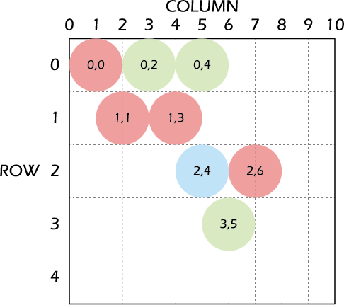
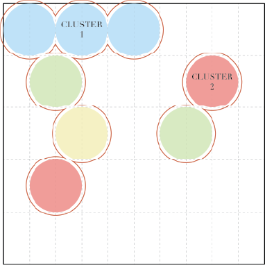

# An Autumn Harvest - Inspired by Puzzle Bobble

## About The Game
### :dragon_face: History and Significance

Puzzle Bobble is a tile-matching puzzle arcade game developed and published by Taito in 1994.

It features a screen filled with multi-coloured bubbles which players must attempt to clear within a given timeframe by shooting more bubbles and making color matches.

Due to time constraints, some simplifications have been made, although core functionality is still present. I hope to expand the basic gameplay to include added functionality in the future.

### :video_game: Gameplay and Instructions
The game begins with a rectangular arena filled with multi-colored bubbles. At the bottom of the arena, the player controls a pointer which aims and fires bubbles into the arena. The color of the bubbles to be fired is randomly generated and chosen from the colored bubbles remaining on the screen.

The main objective of the game is to clear all the bubbles on the screen and ensure that they don't accumulate and reach the bottom of the arena. The bubbles are shot in a straight line based on an angle fixed by the player. If the fired bubble lands and creates a cluster of 3 or more similarly coloured bubbles, they will explode and be cleared. Any bubbles left hanging below will also be cleared. Points are added each time bubbles are cleared.

In an arcade setting, players use a joystick and button to control the shooting trajectory. In my online adaption, players will use the left and right arrow keys to control the shooting trajectory and the space bar to shoot the bubble.

### MVP
- Build the base of the game using HTML and CSS
- Manipulate the DOM using JavaScript and jQuery
- Host the game via Vercel
- Save and update progress on Github
- Implement event listeners which will allow the player to interact with the game using the keyboard

## Technical Structure and Programmatic Code
### Game Screen
The game has two main screens - A start screen and a game screen. The contents for each screen is stored in a separate div and will be shown/hidden through the use of event listeners.

On the start screen, players click the start button to be brought to the game screen.

When the game finishes, players will exit to the main screen to restart the game if they wish.

### Setting up the playing arena (HTML & JS)

The playing arena consists of 10 rows, each consisting of 20 columns (divs), even though the game will only have a maximum of 10 bubbles per row. This is to enable the bubbles to be generated in a honeycomb structure for easy access.

A function then runs to generate randomly colored bubbles and a shooter bubble at the base of the game arena. The random color is assigned as a class and will be used to give appearance properties to each bubble.

### Setting the shooting trajectory
Users control the shooting trajectory by changing the angle of shooting using the L/R arrow keys.

An event listener is setup to rotate the trajectory by a certain angle each time one of the keys is pressed, and a variable (initialized at the beginning) will store the current trajectory angle.

When the player presses the spacebar to shoot the bubble, the current trajectory angle can be accessed from the variable and used to determine the position where the bubble should land.

### Game State
The coordinates of the bubbles which are currently in the arena are stored in an array.

After a bubble has been shot and checked for color clusters/floaters, a function will check for three possible scenarios:
1. The player has won - The array of bubble coordinates will be empty
2. The player has lost - The bubbles have reached the lowest row
3. The game will continue - There are still bubble coordinates in the array and the bubbles have not reached the lowest row

If the player has won/lost, a result message will pop up. By closing the message, the page will reload and the player can choose to play another round.

### Logic to determine where the bubble should land
A function is used to check if the bubble will encounter any collisions in its trajectory path.

There are a few possible scenarios:
1. Right/left collision - A function will run to check the degree of collision and determine the landing position. If there is no collision detected in that row, it will call itself recursively to check the row above
2. Out of screen - If the bubble is shot inaccurately and goes out of screen, a warning message will pop up
3. Top of screen - If the bubble is shot into a space on the top row without encountering any collisions on the left/right, it will stop in that position

Once the landing coordinates have been determined, they are used as arguments for the bubble shooting function.

### Shooting the bubbles
The motion of shooting the bubble is achieved by using an animation that will move the bubble to the determined landing position

### Logic for bubbles to pop
There are two possible scenarios for a bubble to pop:
1. It is within a color cluster of 3 or more of the same color
2. It is left 'floating' (no attachment to the top of the grid) after a cluster has popped

Once it has been determined which bubbles should pop and be removed, a function is run to remove the class attribute from those bubbles (divs) in order to remove its appearance from the grid

#### Color Cluster of 3 or more
This logic uses a recursive function to check the bubbles around the one that was just shot in order to identify if a color cluster has been formed

Let the center bubble in the left diagram be the one that was just shot into the grid
1. Check the 6 spaces around the center bubble
2. If any of the 6 spaces contains a bubble which is the same color as the center and not in the array, it is added into the array
3. Steps 1-3 are then repeated with that bubble as the new center bubble (As shown in diagram on the right)
4. This process continues until there are no more bubbles to be checked
5. If the array contains 3 or more bubbles when the function has stopped running, they will pop and be removed
6. As shown in the above diagram, bubbles with a red 'X' in the center will never be checked as there is no way to link them to the original center bubble

#### Floating Bubbles
This logic uses a recursive function to check if a bubble is connected directly to the screen (either directly or indirectly)

1. Duplicate the array (Bubble Array) containing the coordinates of bubbles which are currently in the grid
2. Add the first bubble in 'Bubble Array' into a new array (Possible Floater Array) and check if the 6 spaces around it contain bubbles
3. If any of the 6 spaces contain bubbles, they are addded into 'Possible Floater Array' and the 6 spaces around them are checked for bubbles
4. This will continue recursively until there are no more spaces to check - An entire cluster of coordinates is contained in 'Possible Floater Array'
5. 'Possible Floater Array' is checked to see if it contains any bubbles in Row 0 - Meaning the cluster is connected to the top of the screen
6. If it is connected, the bubbles will remain undisturbed
7. If the cluster is not connected, it is considered to be 'floating' and will pop and be removed
8. After each round of checking, 'Possible Floater Array' is emptied and the next cluster will be checked

### Modifying the color array
At the end of each round, a function checks if there are any colors which are no longer present in the bubble grid.

If there are any, it removes that color from the pre-set color array and the shooter will not be generated in that color

## Future Improvements
Based on the original Puzzle Bobble game, here are some additional functionalities I hope to implement in the future:
1. Bounce the bubble off the walls
2. Set up a timer to limit the gameplay duration
3. Set up a function to 'drop' the bubbles down by one row each time a certain number of bubbles are shot
4. Set up a highscore board or implement varying levels of difficulty
